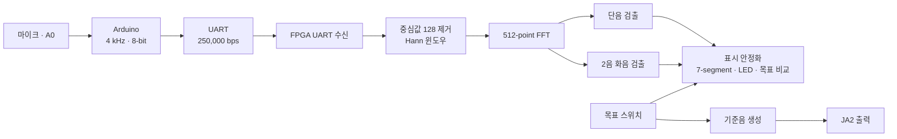

# Project Verilog PitchFFT

Arduino와 Basys3 FPGA를 이용한 **FFT 기반 음정 맞추기 프로젝트**입니다. Arduino가 마이크 신호를 샘플링해 UART로 전송하고, FPGA가 Hann 윈도우와 512-point FFT를 적용해 **C4~C5의 단음 또는 동시에 입력된 두 음**을 판별합니다. 검출 결과는 7-segment와 LED에 표시하며, 선택한 목표 음정과의 일치 여부를 확인할 수 있습니다.

## 주요 기능

- **단음 모드**: C4~C5의 13개 반음 중 입력 음정을 판별하고 목표 음정과 비교
- **2음 화음 모드**: 같은 FFT 프레임에서 두 음을 검출하고 8개 목표 프리셋과 비교
- **배음 기반 판별**: 기본음과 2·3차 배음 정보를 이용해 후보를 평가하고 C4/C5 옥타브 오인식을 완화
- **표시 안정화**: 프레임별 결과를 확인한 뒤 표시를 갱신하고, 무효 입력이 이어지면 표시 해제
- **기준음 출력**: 단음 모드에서 버튼을 누르는 동안 선택한 목표 음의 구형파 출력
- **입력 테스트**: Arduino에서 마이크 입력, 순수 사인파, 배음이 포함된 합성 신호 선택

> 아래 설명은 저장소의 현재 `pitch_fft_voice_top`과 Vivado 프로젝트 설정을 기준으로 합니다. 하드웨어 인식 정확도나 실행 성공을 보장하는 측정 결과는 이 문서에 포함하지 않습니다.

## 시스템 구성



| 항목 | 현재 설정 |
| --- | --- |
| FPGA 보드 | Digilent Basys3 · Artix-7 `xc7a35tcpg236-1` |
| FPGA 클록 | 100 MHz |
| 개발 도구 | Vivado 2024.2, Arduino IDE |
| 오디오 입력 | Arduino A0 · ADC 값을 8-bit로 변환 |
| 샘플링 주파수 | 4,000 Hz · 샘플 간격 250 μs |
| UART | 250,000 bps · 샘플당 원시 데이터 1 byte |
| FFT | 512-point · 16-bit fixed-point 입력 · unscaled · natural order 출력 |
| 윈도우 | 512-point Hann · Q1.15 계수 |
| 주파수 간격 | 4,000 / 512 = **7.8125 Hz/bin** |
| 프레임 수집 시간 | 512 / 4,000 = **128 ms** · 연산 및 표시 갱신 시간 별도 |
| 음정 범위 | C4~C5 · 약 261.63~523.25 Hz |

## 저장소 구조

```text
.
├── README.md
├── _Arduino/
│   └── pitch_fft_voice_sender.ino
└── _FPGA/
    ├── pitch_fft_voice.xpr
    ├── pitch_fft_voice.srcs/
    │   ├── sources_1/
    │   │   ├── imports/
    │   │   │   ├── Downloads/hann512_q15.mem
    │   │   │   └── pitch_fft_voice_final_v2/   # 주요 Verilog 모듈
    │   │   ├── new/                          # 화음 검출 및 오디오 확장 모듈
    │   │   └── ip/                           # FFT IP 설정
    │   └── constrs_1/imports/Downloads/
    │       └── pitch_fft_voice.xdc            # 현재 프로젝트의 활성 제약 파일
    ├── pitch_fft_voice.runs/                  # 합성·구현 결과
    ├── pitch_fft_voice.gen/                   # 생성된 IP 파일
    ├── pitch_fft_voice.cache/
    └── pitch_fft_voice.ip_user_files/
```

### 주요 소스

아래 파일명은 `pitch_fft_voice.srcs/sources_1/` 기준입니다.

| 파일 | 역할 |
| --- | --- |
| `imports/pitch_fft_voice_final_v2/pitch_fft_voice_top.v` | UART, FFT, 검출기, 목표 비교 및 표시 연결 |
| `imports/pitch_fft_voice_final_v2/uart_rx.v` | 8-bit UART 데이터 수신 |
| `imports/pitch_fft_voice_final_v2/hann_window.v` | 샘플에 Hann 윈도우 적용 |
| `imports/Downloads/hann512_q15.mem` | 현재 사용하는 512개 윈도우 계수 |
| `imports/pitch_fft_voice_final_v2/harmonic_pitch_detector.v` | 기본음·배음 기반 단음 검출 |
| `new/chord_pitch_detector.v` | 두 음 후보 선택, 옥타브 억제 및 결과 안정화 |
| `imports/pitch_fft_voice_final_v2/bin_to_note.v` | FFT bin을 C4~C5 음정 코드로 변환 |
| `imports/pitch_fft_voice_final_v2/note_display.v` | 4자리 7-segment 표시 |
| `imports/pitch_fft_voice_final_v2/tone_gen.v` | 목표 음정 구형파 생성 |
| `ip/xfft_0_1/xfft_0.xci` | 현재 `.xpr`에서 참조하는 FFT IP |
| `imports/pitch_fft_voice_final_v2/tb_pitch_fft_voice_top.v` | 기존 통합 테스트벤치 · 현재 인터페이스에 맞춘 수정 필요 |

`new/audio_record_playback.v`와 `new/i2s_pcm5102_tx.v`도 저장되어 있지만, 현재 최상위 모듈에는 연결되어 있지 않습니다. PCM5102A 녹음·재생 기능을 현재 동작 기능으로 취급하지 않습니다.

## 하드웨어 연결

준비물은 Basys3, Arduino 보드, 아날로그 출력 마이크 모듈, 연결선과 필요 시 레벨 변환 회로 및 기준음 출력용 수동 부저입니다. Arduino 모델과 마이크 모델은 저장소에 명시되어 있지 않습니다.

| 연결 | 설명 |
| --- | --- |
| 마이크 아날로그 출력 → Arduino A0 | ADC 입력 |
| Arduino D1(TX) → Basys3 JA1 | 오디오 샘플 UART 입력 · FPGA 핀 J1 |
| Arduino GND ↔ Basys3 GND | 공통 접지 |
| Basys3 JA2 → 기준음 출력 회로 | 구형파 출력 · FPGA 핀 L2 |

**5 V Arduino의 TX를 Basys3에 연결할 때는 3.3 V 레벨로 변환해야 합니다.** 코드 주석도 TX와 JA1 사이의 분압 회로를 전제로 합니다. 마이크 전원과 출력 범위는 사용하는 Arduino·마이크 사양에 맞춰 구성하세요.

## 시작하기

### 1. 프로젝트 내려받기

```bash
git clone https://github.com/KanghyuckMoon/Project_Verilog_PitchFFT.git
cd Project_Verilog_PitchFFT
```

### 2. FPGA 설정 및 프로그래밍

1. Vivado 2024.2에서 [`_FPGA/pitch_fft_voice.xpr`](_FPGA/pitch_fft_voice.xpr)를 엽니다.
2. 대상 장치가 `xc7a35tcpg236-1`, 최상위 모듈이 `pitch_fft_voice_top`인지 확인합니다.
3. 활성 제약 파일이 `constrs_1/imports/Downloads/pitch_fft_voice.xdc`인지 확인합니다. 다른 경로의 구형 제약 파일을 함께 활성화하지 않습니다.
4. IP 상태를 확인하고 필요하면 `xfft_0`의 Output Products를 생성합니다. 현재 참조하는 설정은 `sources_1/ip/xfft_0_1/xfft_0.xci`입니다.
5. `hann512_q15.mem`이 프로젝트에 포함되어 있는지 확인합니다. `hann_window.v`가 이 파일명을 `$readmemh`로 읽습니다.
6. **Run Synthesis → Run Implementation → Generate Bitstream** 순서로 실행합니다.
7. **Hardware Manager → Open Target → Program Device**에서 생성한 비트스트림으로 보드를 프로그래밍합니다.

저장소에는 기존 비트스트림 `_FPGA/pitch_fft_voice.runs/impl_1/pitch_fft_voice_top.bit`도 포함되어 있습니다. 소스와 설정을 변경했다면 새로 생성한 파일을 사용하세요.

### 3. Arduino 입력 설정

[`_Arduino/pitch_fft_voice_sender.ino`](_Arduino/pitch_fft_voice_sender.ino)를 열고 `MODE`를 선택한 뒤 보드에 업로드합니다.

| `MODE` | 입력 |
| --- | --- |
| `0` | A0 마이크 입력 · 현재 기본값 |
| `1` | `FAKE_HZ` 주파수의 순수 사인파 |
| `2` | `FAKE_HZ` 기본음에 2·3차 배음을 더한 합성 신호 |

`FAKE_HZ`의 기본값은 **440 Hz(A4)**입니다. 먼저 `MODE = 1` 또는 `2`로 UART 연결과 단음 표시를 확인한 다음 마이크 입력으로 전환하면 됩니다. 이 합성 신호는 단일 기본음 테스트용이며 두 음 화음 테스트 신호는 아닙니다.

## 조작 방법

| 입력 | 기능 |
| --- | --- |
| `BTNC` | 리셋 |
| `SW15 = 0` | 단음 모드 |
| `SW15 = 1` | 2음 화음 모드 |
| `SW3..SW0` | 단음 모드의 목표 음정 코드 |
| `SW2..SW0` | 화음 모드의 목표 프리셋 · SW3은 사용하지 않음 |
| `BTNU` | 단음 모드에서 누르는 동안 목표 기준음 출력 · 화음 모드에서는 출력하지 않음 |

### 단음 목표 코드

스위치는 `SW3 SW2 SW1 SW0` 순서의 이진 코드로 설정합니다.

| 코드 | 목표 음 | 코드 | 목표 음 |
| --- | --- | --- | --- |
| `0001` | C4 | `1000` | G4 |
| `0010` | C#4 | `1001` | G#4 |
| `0011` | D4 | `1010` | A4 |
| `0100` | D#4 | `1011` | A#4 |
| `0101` | E4 | `1100` | B4 |
| `0110` | F4 | `1101` | C5 |
| `0111` | F#4 | `0000`, `1110`, `1111` | 목표 없음 |

예를 들어 Arduino의 440 Hz 테스트 신호에는 **SW15=0, SW3..SW0=1010**으로 목표를 설정합니다.

### 화음 목표 프리셋

| SW2 SW1 SW0 | 목표 두 음 |
| --- | --- |
| `000` | C4 + E4 |
| `001` | C4 + G4 |
| `010` | D4 + F#4 |
| `011` | D4 + A4 |
| `100` | E4 + G#4 |
| `101` | F4 + A4 |
| `110` | G4 + B4 |
| `111` | A4 + C5 |

화음 검출기는 C4~C5 범위의 두 음 후보를 평가합니다. 위 표는 목표 비교용 프리셋입니다. **C4 + C5 옥타브 조합은 지원하지 않습니다.** C5 기본음과 C4의 2차 배음이 같은 주파수 영역에 놓이기 때문입니다.

## 결과 읽기

### 7-segment

- **단음 모드**: 왼쪽 두 자리 = 검출 음, 오른쪽 두 자리 = 목표 음
- **화음 모드**: 왼쪽 두 자리 = 검출된 낮은 음, 오른쪽 두 자리 = 검출된 높은 음
- **샤프(#)**: 음이름 자리의 소수점으로 표현 · 예: `C.4` = C#4
- **유효한 음 없음**: 해당 두 자리를 `--`로 표시

### LED

| LED | 단음 모드 | 화음 모드 |
| --- | --- | --- |
| LD0~LD12 | 검출 음 하나 표시 · C4~C5 순서 | 선택한 목표 두 음 표시 · C4~C5 순서 |
| LD13 | 2·3차 배음 중 하나 이상 확인 | 화음 모드 표시 |
| LD14 | 2·3차 배음 모두 확인 | 두 음 검출 유효 |
| LD15 | 검출 음과 목표 음 일치 | 검출된 두 음과 목표 두 음 모두 일치 |

배음 LED는 배음 확인 여부를 나타내며, 단음 검출 자체가 반드시 두 배음을 요구하는 것은 아닙니다.

## 검출 방식과 조정

FPGA는 수신한 unsigned 8-bit 샘플에서 128을 빼고 Hann 윈도우를 적용합니다. FFT 출력의 실수부·허수부로부터 `|Re| + |Im|` 근사 크기를 계산한 뒤 음정 후보를 평가합니다.

- **단음**: 음정별 기본음 주변 bin과 2·3차 배음을 탐색합니다. 일반 후보의 점수는 `2F + H2 + H3/2`이며, C4의 분산된 기본음 에너지와 C5로 잘못 검출될 수 있는 배음을 별도로 보정합니다.
- **화음**: 음정별로 겹치지 않는 두 기본음 bin을 사용하고 배음 검증을 거쳐 두 후보를 선택합니다. 이전 음쌍을 유지하는 히스테리시스와 낮은 에너지의 잔향 제거 로직으로 결과 변동을 완화합니다.

입력 레벨에 맞춰 최상위 모듈의 임계값을 조정할 수 있습니다.

| 파라미터 | 기본값 | 용도 |
| --- | --- | --- |
| `FUND_MIN` | 240 | 단음 기본음 임계값 |
| `HARM_MIN` | 200 | 단음 배음 임계값 |
| `SCORE_MIN` | 1400 | 단음 점수 임계값 |
| `CHORD_FUND_MIN` | 120 | 화음 기본음 임계값 |
| `CHORD_SCORE_MIN` | 700 | 화음 점수 임계값 |

샘플링 주파수나 FFT 길이를 변경하면 Arduino 설정뿐 아니라 FFT IP, Hann 계수, 음정 bin 매핑과 검출기의 배음 탐색 위치도 함께 검토해야 합니다.

## 테스트 및 현재 제약

### 보드에서 확인할 순서

1. Arduino `MODE = 1`, `FAKE_HZ = 440.0`으로 단음 입력을 전송합니다.
2. 목표를 A4(`1010`)로 설정하고 A4 표시와 LD15 일치를 확인합니다.
3. `MODE = 2`로 바꿔 배음이 포함된 입력에서 음정 표시와 배음 LED를 확인합니다.
4. `MODE = 0`으로 전환하고 마이크 입력 레벨에 맞춰 임계값을 조정합니다.
5. 화음 모드에서는 두 음을 동시에 낼 수 있는 외부 음원으로 표시와 목표 일치를 확인합니다.

### 시뮬레이션 준비

기존 `tb_pitch_fft_voice_top.v`는 순수 A4 및 배음 추가 신호를 시험하도록 작성되었지만 **현재 최상위 모듈과 맞지 않습니다**. 실행 전에 다음 항목을 갱신해야 합니다.

- 테스트벤치에 `mode_chord` 입력을 연결하고 `sw_tgt`를 현재 4-bit 코드로 수정
- 현재 최상위 모듈에 없는 `jb_bck`, `jb_lrck`, `jb_din` 연결 제거
- 256개 샘플 기준의 테스트 프레임을 현재 512개 샘플 기준으로 수정
- 기존 LED 기대값을 현재 LED 배치에 맞게 수정
- Vivado의 `xfft_0` 시뮬레이션 모델과 `hann512_q15.mem`을 준비

위 수정 후 시뮬레이션 최상위 모듈을 `tb_pitch_fft_voice_top`으로 설정하고 Behavioral Simulation을 실행합니다. 기존 테스트벤치는 현재 구현의 검증 완료 근거로 사용할 수 없습니다.

